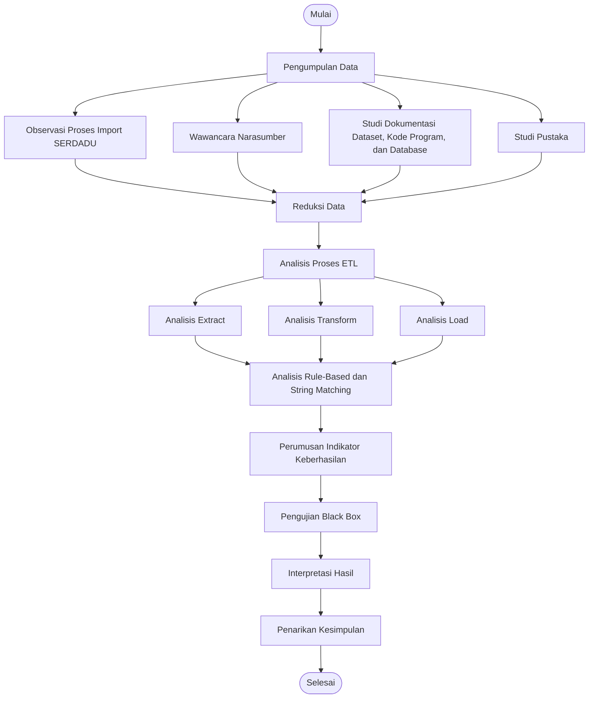
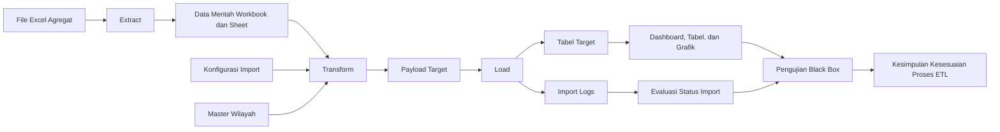
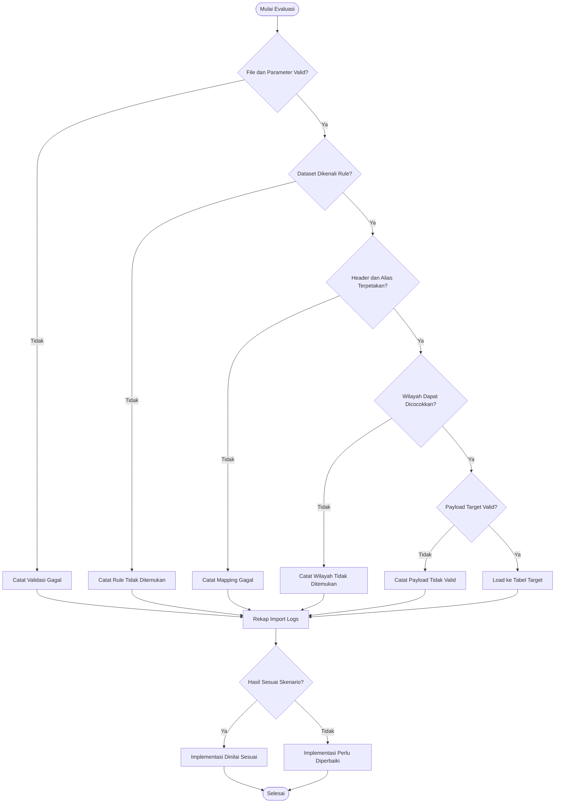

# Tabel dan Gambar Tambahan Bab III

Dokumen ini berisi tabel dan gambar tambahan yang dapat digunakan untuk memperkuat Bab III proposal skripsi. Nomor tabel dan gambar dapat disesuaikan kembali dengan urutan akhir pada dokumen Word.

## Tabel Ringkasan Hasil Wawancara

**Tabel 3.x Ringkasan Hasil Wawancara**

| No. | Aspek yang Ditanyakan | Hasil Wawancara | Implikasi terhadap Penelitian |
|---:|---|---|---|
| 1 | Mekanisme keluarnya data agregat | Data agregat kependudukan diterbitkan secara periodik setiap semester. | Memperkuat kebutuhan atribut periode berupa tahun dan semester pada proses *extract* dan *load*. |
| 2 | Bentuk data yang diterima | Data diberikan dalam bentuk file Excel agregat yang dikelompokkan berdasarkan kategori kependudukan. | Menjadi dasar penggunaan file Excel sebagai sumber data utama penelitian. |
| 3 | Kategori data | Data mencakup beberapa kategori seperti jenis kelamin, agama, pekerjaan, pendidikan, status perkawinan, kepala keluarga, wajib KTP, kepemilikan KK, KIA, akta kelahiran, akta kawin cerai, kelompok umur, dan umur tunggal. | Menjadi dasar pembatasan ruang lingkup penelitian pada kategori data agregat yang diproses oleh SERDADU. |
| 4 | Kebutuhan tampilan sistem | Data perlu ditampilkan kembali dalam bentuk dashboard, tabel, grafik, dan informasi berbasis wilayah. | Menunjukkan bahwa hasil ETL harus tersimpan dalam struktur basis data yang siap disajikan kembali oleh sistem. |
| 5 | Kendala pada data sumber | File Excel memiliki variasi format, nama file, nama sheet, header kolom, dan pola kode wilayah. | Menjadi dasar penggunaan pendekatan *rule-based* dan *string matching* pada tahap transformasi data. |

## Tabel Sumber Data Penelitian

**Tabel 3.x Sumber Data Penelitian**

| No. | Sumber Data | Bentuk Data | Kegunaan dalam Penelitian |
|---:|---|---|---|
| 1 | File Excel agregat kependudukan | Dataset spreadsheet pada folder data agregat | Digunakan sebagai data sumber pada proses *extract* dan bahan analisis variasi format data. |
| 2 | Hasil wawancara narasumber | Informasi lisan yang diringkas dalam catatan penelitian | Digunakan untuk memahami pola keluarnya data, kategori data, dan kebutuhan tampilan sistem. |
| 3 | Kode program proses *import* | Controller, service, dan komponen pendukung proses *import* | Digunakan untuk menganalisis implementasi teknis proses ETL pada SERDADU. |
| 4 | Konfigurasi pemetaan *import* | Aturan kategori, tabel target, kolom sumber, kolom target, dan alias | Digunakan untuk menganalisis penerapan pendekatan *rule-based*. |
| 5 | Struktur basis data target | Tabel master wilayah, tabel agregat, dan *import logs* | Digunakan untuk mengetahui tujuan pemuatan data pada tahap *load*. |
| 6 | Referensi ilmiah | Jurnal, peraturan, dan sumber teori pendukung | Digunakan sebagai landasan teori ETL, migrasi data, *rule-based*, *string matching*, dan pengujian. |

## Tabel Kebutuhan Fungsional dan Nonfungsional

**Tabel 3.x Kebutuhan Fungsional dan Nonfungsional**

| No. | Jenis Kebutuhan | Kebutuhan | Uraian |
|---:|---|---|---|
| 1 | Fungsional | Memilih periode data | Sistem menyediakan input tahun dan semester sebagai identitas periode data agregat. |
| 2 | Fungsional | Memilih kategori data | Sistem menyediakan pilihan kategori agar file Excel diarahkan ke rule dan tabel target yang sesuai. |
| 3 | Fungsional | Mengunggah file Excel | Admin dapat mengunggah file Excel agregat melalui halaman *import*. |
| 4 | Fungsional | Memvalidasi input | Sistem memeriksa kelengkapan tahun, semester, kategori, dan file sebelum proses dijalankan. |
| 5 | Fungsional | Membaca workbook dan sheet | Sistem membaca isi file Excel untuk memperoleh sheet, header, dan baris data. |
| 6 | Fungsional | Menjalankan transformasi data | Sistem menerapkan *rule-based* dan *string matching* untuk memetakan data sumber ke struktur target. |
| 7 | Fungsional | Memuat data ke tabel target | Sistem menyimpan hasil transformasi ke tabel target dengan mekanisme *upsert*. |
| 8 | Fungsional | Mencatat status proses | Sistem mencatat hasil proses pada *import logs*, termasuk jumlah data berhasil, gagal, dan pesan kesalahan. |
| 9 | Nonfungsional | Keterlacakan proses | Setiap proses *import* harus dapat ditelusuri melalui catatan log. |
| 10 | Nonfungsional | Konsistensi data | Data hasil transformasi harus tersimpan sesuai periode, wilayah, kategori, dan tabel target. |
| 11 | Nonfungsional | Ketahanan terhadap variasi format | Sistem perlu mampu menangani variasi nama file, sheet, header, alias, dan kode wilayah. |
| 12 | Nonfungsional | Kejelasan validasi | Sistem perlu memberikan informasi apabila input tidak lengkap atau data tidak dapat diproses. |

## Tabel Pemetaan ETL

**Tabel 3.x Pemetaan Tahap ETL pada SERDADU**

| Tahap ETL | Input | Proses | Metode/Pendekatan | Output |
|---|---|---|---|---|
| *Extract* | File Excel agregat, tahun, semester, kategori | Validasi parameter, penyimpanan file sementara, pembacaan workbook, pembacaan sheet, dan pembacaan header | Validasi input dan pembacaan spreadsheet | Data mentah dari file Excel yang siap ditransformasi |
| *Transform* | Data hasil *extract*, konfigurasi *import*, master wilayah | Normalisasi nama file, nama sheet, header, alias, pencocokan wilayah, pemetaan kolom, dan pembentukan payload | *Rule-based* dan *string matching* | Payload data yang sesuai dengan struktur tabel target |
| *Load* | Payload hasil transformasi | Penyimpanan ke tabel target, pembaruan data jika kunci unik sudah ada, penambahan data baru jika belum ada, dan pencatatan log | *Upsert* dan pencatatan *import logs* | Data agregat tersimpan pada basis data target dan status proses tercatat |

## Tabel Indikator Keberhasilan ETL

**Tabel 3.x Indikator Keberhasilan Proses ETL**

| No. | Tahap | Indikator Keberhasilan | Cara Memeriksa | Hasil yang Diharapkan |
|---:|---|---|---|---|
| 1 | *Extract* | File Excel dapat diterima oleh sistem | Mengunggah file melalui halaman *import* admin | Sistem menerima file dan melanjutkan proses pembacaan workbook. |
| 2 | *Extract* | Parameter periode dan kategori tervalidasi | Mengisi tahun, semester, kategori, dan file | Sistem hanya memproses data jika parameter wajib lengkap. |
| 3 | *Extract* | Sheet dapat dibaca | Memeriksa hasil pembacaan workbook | Sistem menemukan sheet yang sesuai untuk diproses. |
| 4 | *Transform* | Nama file atau sheet dikenali | Membandingkan nama file/sheet dengan rule *import* | Sistem memilih rule *import* yang sesuai. |
| 5 | *Transform* | Header kolom dapat dinormalisasi | Membandingkan variasi header dengan mapping dan alias | Header sumber terhubung dengan atribut target yang benar. |
| 6 | *Transform* | Wilayah dapat dicocokkan | Membandingkan kode atau nama wilayah dengan master wilayah | Data wilayah terhubung dengan kecamatan dan desa yang sesuai. |
| 7 | *Transform* | Payload target terbentuk | Memeriksa data hasil transformasi sebelum disimpan | Payload memuat tahun, semester, wilayah, kategori, dan nilai agregat yang sesuai. |
| 8 | *Load* | Data berhasil tersimpan | Memeriksa tabel target setelah proses *import* | Data baru ditambahkan atau data lama diperbarui sesuai kunci unik. |
| 9 | *Load* | Status proses tercatat | Memeriksa tabel *import logs* | Sistem mencatat status, jumlah baris berhasil, jumlah baris gagal, dan pesan kesalahan. |
| 10 | Evaluasi | Output sistem sesuai skenario | Membandingkan hasil sistem dengan tabel pengujian | Setiap skenario menghasilkan keluaran sesuai harapan. |

## Tabel Penguatan Skenario Pengujian Black Box

**Tabel 3.x Penguatan Skenario Pengujian Black Box**

| No. | Kelompok Uji | Skenario | Data Uji | Hasil yang Diharapkan |
|---:|---|---|---|---|
| 1 | Validasi halaman | Admin membuka halaman *import* | Akses menu *import* admin | Sistem menampilkan form tahun, semester, kategori, unggah file, dan tombol proses. |
| 2 | Validasi input | Form dikirim tanpa file | Tahun, semester, dan kategori diisi, file kosong | Sistem menolak proses dan menampilkan pesan validasi file wajib diunggah. |
| 3 | Validasi input | Form dikirim tanpa kategori | Tahun dan semester diisi, kategori kosong | Sistem menolak proses dan menampilkan pesan validasi kategori wajib dipilih. |
| 4 | *Extract* | File Excel valid diunggah | File Excel agregat sesuai kategori | Sistem menyimpan file sementara dan membaca workbook. |
| 5 | *Transform* | Nama file atau sheet sesuai rule | File dengan nama atau sheet yang dikenali | Sistem memilih konfigurasi *import* yang sesuai. |
| 6 | *Transform* | Header memiliki alias | Header sumber memiliki variasi penulisan | Sistem menormalisasi header dan memetakan kolom ke atribut target. |
| 7 | *Transform* | Kode wilayah memiliki variasi format | Kode wilayah bertitik atau tanpa titik | Sistem mengenali wilayah berdasarkan master kecamatan dan desa. |
| 8 | *Load* | Data hasil transformasi valid | Payload lengkap dan sesuai tabel target | Sistem melakukan *upsert* ke tabel target. |
| 9 | Pencatatan log | Terdapat baris gagal diproses | Data wilayah tidak ditemukan atau header tidak sesuai | Sistem mencatat jumlah baris gagal dan pesan kesalahan pada *import logs*. |
| 10 | Output | Proses *import* selesai | File berhasil diproses | Sistem menampilkan ringkasan hasil *import* dan data dapat ditampilkan kembali. |

## Gambar Alur Analisis Data

**Gambar 3.x Alur Analisis Data Penelitian**

## Gambar Alur Keterkaitan Data, ETL, dan Pengujian

**Gambar 3.x Keterkaitan Data Sumber, Proses ETL, dan Pengujian**

## Gambar Alur Evaluasi Kesesuaian Implementasi ETL

**Gambar 3.x Alur Evaluasi Kesesuaian Implementasi ETL**

